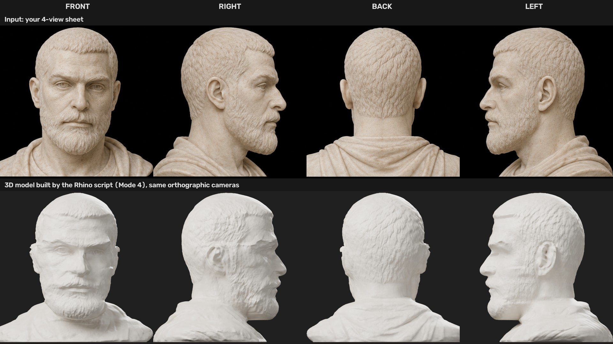
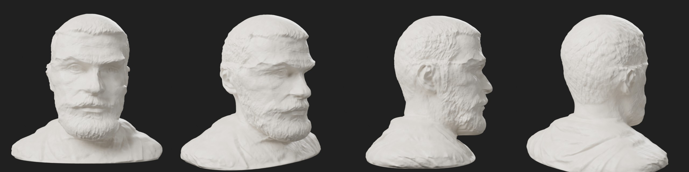
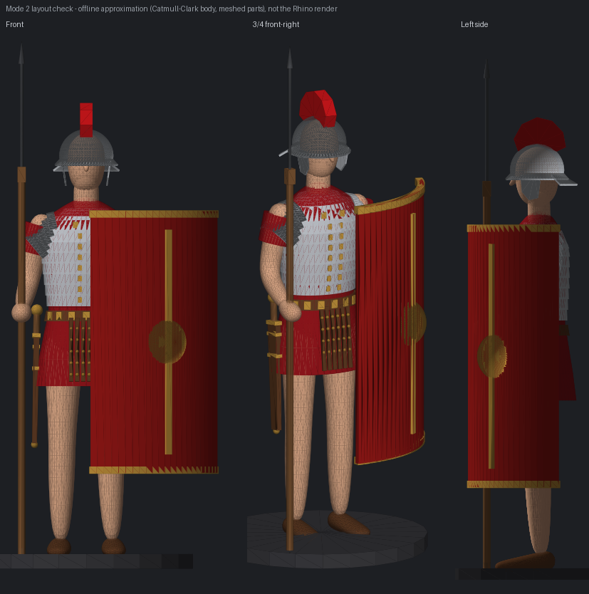

# Image → clean 3D → clean render → CNC: toolkit

*Checked 1 Oct 2026 for Styro3D. Ranked picks come first. **(U)** = unverified (search snippet only).*

**Best Gemini model for this:** Nano Banana Pro (Gemini 3 Pro Image). Use it to turn one photo into matching front / side / back views.

**Files in this folder**

| File | What it is |
|---|---|
| `styro3d_ai_to_cnc.py` | Rhino 7 / 8 script (v1.2). Mode 1: AI mesh → clean → CNC. Mode 2: build the legionary from code. Mode 3: build it, then run the CNC steps. **Mode 4: the marble bust rebuilt from your 4-view sheet. Mode 5: bust → CNC.** |
| `bust4v_compare.jpg` | Your 4 views next to Cycles renders of exactly what Mode 4 builds, same cameras |
| `bust4v_views.jpg` | Mode 4 bust in perspective: front, 3/4, profile, back 3/4 |
| `pipeline/multiview/` | Code that turned the 4 views into the Mode 4 data (`pipeline/` = the older one-photo version) |
| `TOOLKIT.md` | This file: every tool, ranked, with install commands |

---

## 1. Short answer

| Question | Answer |
|---|---|
| Is the picture real? | **Not verified.** About 40 searches did not find the original post. Similar real tests exist, e.g. *"Opus 5.5 vs GPT-6 Astra — one prompt, Blender only, all procedural"*: Opus took 35 min, ~200k output tokens, ~$13 (U). GPT-6 Sol and Astra are OpenAI models released Sep 2026. |
| Why does the Opus figure look so much better? | Probably a different pipeline, not just better code. Blender MCP can pull in Sketchfab models and generate meshes with Rodin / Hunyuan / Tripo, so "made in Blender" does not mean the model wrote the geometry. Ask for the wireframe, the .blend file and the tool log. |
| Can Opus 5.5 do it from one image? | **Yes, but not alone.** Opus 5.5 is the operator: it plans, calls an image-to-3D model, writes Blender / Rhino code, checks renders and fixes. The mesh itself comes from the generator or from code. |
| Clean topology? | Hard parts (helmet, plates, shield, spear): **yes**, clean quads from code or Quad Remesher. Face, hands, cloth: **usable** quads from auto-retopo. Animation-grade face loops still need a manual pass (RetopoFlow). |
| Clean render? | **Yes.** This is the easy part: Blender 5.2 Cycles + HDRI + PBR materials. |
| The catch | **A render hides topology.** Never judge topology from a render; ask for a wireframe. |
| For CNC / foam | **You do not need quads.** You need a closed (watertight) mesh, real scale and enough density. Quads are for editing, smoothing and rendering. |

---

## 2. Three routes (ranked)

| # | Route | Result | Time |
|---|---|---|---|
| **1** | **Hybrid:** AI mesh for body / face / cloth + hard parts rebuilt clean (code or retopo) + PBR + Cycles | Closest to the photo, clean where it matters | ½–1 day |
| 2 | **AI mesh + auto-retopo:** generator in quad mode (Tripo / Meshy / Rodin) → Quad Remesher → render | Fast, good topology on smooth parts | 1–2 h |
| 3 | **Code only:** Opus writes Blender or Rhino code (like the other two figures, and Mode 2 of the script) | 100% editable clean geometry, stylised, weak face | 1–2 h |

---

## 3. Pipeline: best tool per step

| Step | Do this | Best pick (alternatives) |
|---|---|---|
| 0 Prep | Cut the background, upscale to 2K+, full body visible | Higgsfield bg remover / Topaz (rembg, Photoshop) |
| 1 Views | Make an A-pose front / side / back sheet. Throw away sheets where the shield side or plates change between views. | **Nano Banana Pro** (Nano Banana 2 for fast tries, MV-Adapter local) |
| 2 Image → 3D | Use multi-view input. Generate props (shield, spear, helmet) separately from cropped images. | **Tripo H3.1 multiview** for detail, **Tripo P2.0 quad** (≤25K quads) for a base cage (Hunyuan3D 3.1, Rodin Gen-2.5, Meshy 7) |
| 3 Split parts | Body, helmet, armour, shield, spear, sword as separate objects | Tripo segmentation, Hunyuan PartGen 1.5, Rodin BANG, Meshy Auto Split |
| 4 Retopo | Hard parts auto, face / hands manual | **Quad Remesher** + **RetopoFlow 4** (Rhino QuadRemesh, ZRemesher, 3DCoat AutoPo, Instant Meshes free) |
| 5 UV / bake / paint | UV → bake high → low → paint | RizomUV / UVPackmaster 4 → **Marmoset 5** bake → **Substance Painter 12.1**; CC0 materials from Poly Haven / ambientCG |
| 6 Render | Studio HDRI + key / rim light, 85 mm lens, dark backdrop. Deliver beauty + clay + wireframe + turntable. | **Blender 5.2 LTS Cycles**, AgX (hero) or Khronos PBR Neutral (true colour), OIDN denoise |
| 7 CNC | Start from the dense mesh, not the quad mesh: watertight, scale, checks, blocks, STL | **`styro3d_ai_to_cnc.py` Mode 1** + Rhino 8 ShrinkWrap → RhinoCAM / Carveco / your ArtCAM / RoboDK |

AI textures have lighting baked in, so use them only as a base layer.

---

## 4. Already available in this Claude session (no install)

The **Higgsfield AI** connector is attached here. I read its live model list on 1 Oct 2026. Each generation costs credits.

| Job | Models available |
|---|---|
| Image → 3D | **Meshy 7** (quad or triangle, ultra mode, PBR, rig), **Tripo H3.1** single image + multiview (quad option, up to 2M faces), **Hunyuan3D v3** (multiview, LowPoly quad mode, up to 1.5M faces), Meta **SAM 3D Objects** / **SAM 3D Body** |
| Fix / redo | Meshy 5 Remesh (quad, target count), Meshy 5 Retexture, Meshy auto-rig + 678 animations |
| Views / images | **Nano Banana Pro**, Nano Banana 2, GPT Image 2.5, FLUX.2, Seedream 5, background remover, Topaz upscale |
| Scene + render | "3D Jutsu" scene builder: headless **Blender 5.2**, runs bpy code, exports .blend / .glb and renders PNG |

The session container itself also runs Blender as a Python module (`pip install bpy` 5.0.1; CPU only, no GPU).

---

## 5. The Rhino script

**Run:** in Rhino 7 or 8, run `_RunPythonScript` and pick `styro3d_ai_to_cnc.py`. One Ctrl+Z undoes the whole run, and Esc cancels long steps.

| Mode | Input | What it does |
|---|---|---|
| 1 AI mesh → CNC | Select a mesh, or press Enter to import OBJ / STL / FBX / PLY / 3MF (GLB needs Rhino 8) | weld seams → fix up-axis → scale to real height → drop floaters and inner shells → heal + fill holes → fix normals → ShrinkWrap (Rhino 8) → **checks** → QuadRemesh → SubD → PNG previews → binary STL (mm) + report |
| 2 Build legionary | A settings dialog | SubD body + NURBS hoops, shoulder bands, helmet (dome, neck guard, cheek guards, crest), curved scutum with boss, pilum, gladius, base. Real scale, layers, PBR materials, render PNG. |
| 3 Build → CNC | Same as Mode 2 | Mode 2, then meshes and joins all parts and runs the Mode 1 checks and STL export |

**CNC checks in the report:**
- Thin walls below X mm, shown as red points.
- Undercut % for top setup + flipped setup, with the undercut faces shown in magenta.
- Foam block grid and block count.
- Part volume, EPS weight and material yield.

**Layers:**
- `S3D::01_CNC_Mesh` is the STL source.
- `02_QuadMesh` and `03_SubD` are for editing and rendering.
- `04` / `05` are the checks.
- `06` is the foam blocks.
- `S3D_Legionary::*` holds the built figure, one layer per material.

### Mode 4 / 5: Roman marble bust from your 4-view sheet (v1.2)

**What the script builds:** a closed bust of about 800k quads: flat base, chest, neck, head, and a pole at the crown. It is a single watertight solid at life size (290 mm tall, 6.8 L), and you can scale it to any height. It gets a marble PBR material and an optional round socle. Mode 5 then runs the CNC checks and exports STL.

**How it was made from the FRONT / RIGHT / BACK / LEFT sheet, with no AI 3D generator:**
1. **Align:** split the sheet, cut the bust out of each view and put all 4 into one frame (0.618 mm per pixel, from the face model). The AI views do not line up exactly; for example, the left view's face sits about 12 px higher. Each view gets a small height correction that matches the head top, brow, nose, mouth, beard tip and base.
2. **Base shape:**
   - Cross-sections at every height, fitted to the outlines: front and back give the width, the sides give the depth.
   - The face from 468 MediaPipe points. Its depth is calibrated to the side profile, so the nose, lips and chin match.
   - Both ears, placed from the side views.
3. **Detail:** linear shape-from-shading plus fine relief, run separately in each view. It recovers hair curls, beard, eyes, brows, ear folds and drapery folds.
4. **Merge:** the 4 detailed depth maps are fused into one solid.
   - Each view counts more where it looks straight at the surface.
   - The views are pulled into agreement at large scale but keep their fine detail.
   - The solid is cut to the front and side outlines.
5. **Store:** the shape is a radius map (691 KB of text at the end of the `.py`). Rebuild error is 0.08 mm max.

**Checked:**
- Closed manifold: Euler 2, no open or non-manifold edges, consistent winding. 2 folded cells out of 798k.
- Python 2.7 grammar parse; all offline tests pass.

**Limits:**
- The 4 AI views do not agree 100%: the back view's head is about 10 mm narrower than the front view's, and the drapery folds differ per view. The model takes the average, so each view matches within a few mm, not pixel-exact.
- Areas no view sees straight on are smoother: the crown, under the beard and the shoulder tops.
- The ears are solid behind (no gap). That is good for foam CNC because there is no undercut.
- Eye and lip detail is limited by the sheet size (the face is about 200 px wide). A sheet with 2048+ px per view gives sharper detail.

**Mode 2 output** (offline layout check built from the same numbers; Rhino shows it smoother, with PBR materials):

**Limits:**
- Rhino 7 has no ShrinkWrap. If a mesh stays open, run MeshRepair, or remesh it in Blender (Voxel) or with Meshy Remesh.
- Mode 2 is a stylised figure, not a photo match. Nudge parts with Gumball if needed.
- Thin plates (shoulder bands, cheek guards, apron straps) get flagged for foam. Set *Min plate thickness* to 15+ mm, or cut them from ACP or wood.

**How it was checked:**
- Every RhinoCommon call was checked against the official 7.38 and 8.35 SDKs.
- Offline tests passed:
  - Python 2.7 and 3 syntax.
  - Every SubD cage is closed and outward-facing.
  - The STL is watertight.
  - Mode 2 parts touch each other: feet sink 13 mm into the base, the shield grips the hand at 5 mm, and nothing collides.
- It has not been run inside Rhino. If anything errors, paste the command-line text back.

---

## 6. Claude Code skills (found with find-skills, then vetted)

`find-skills` is installed in this repo (`.claude/skills/find-skills`). Note: the correct command is `npx skills add vercel-labs/skills --skill find-skills` (no `cmd`).

| Rank | Skill | Why | Install |
|---|---|---|---|
| 1 | **scenario-labs/skills** (819★): 13 Blender skills: retopology, hard-surface, UV / baking, lighting / render, geometry nodes | Tested headless on Blender 5.2.1. Install the whole family; the specialist skills import the lead one. | `npx skills add scenario-labs/skills --skill scenario-blender-expert --skill scenario-blender-retopology --skill scenario-blender-hard-surface --skill scenario-blender-uv-baking --skill scenario-blender-texturing-shading --skill scenario-blender-lighting-rendering --skill scenario-blender-geometry-nodes --skill scenario-blender-sculpting --skill scenario-blender-rigging --skill scenario-blender-animation --skill scenario-blender-hair --skill scenario-blender-grease-pencil --skill scenario-blender-previs-storyboard` |
| 2 | **meshy-dev/meshy-3d-agent** (official Meshy, MIT): generation, remesh, UV, rig, 3D-print repair | Drives the Meshy API without an MCP server (Pro plan) | `npx skills add meshy-dev/meshy-3d-agent` |
| 3 | **DeemosTech/rodin3d-skills** (official Rodin) | Gen-2 image / multi-view to 3D, `--mesh-mode Quad`, STL / FBX / GLB | `/plugin marketplace add DeemosTech/rodin3d-skills` then `/plugin install rodin3d-skill@rodin3d-skills` |
| 4 | **github/awesome-copilot · rhino3d-scripts** (GitHub org repo) | RhinoPython / RhinoCommon patterns for Rhino 7 IronPython and Rhino 8 | `npx skills add github/awesome-copilot --skill rhino3d-scripts` |
| 5 | **majidmanzarpour/blender-game-skills · blender-image-to-3d** (120★) | Image-to-3D loop that checks renders from a camera matched to the reference | `npx skills add majidmanzarpour/blender-game-skills --skill blender-image-to-3d -g -a claude-code` |
| 6 | **earthtojake/text-to-cad** (16.5k★, MIT) | build123d CAD, DFM review for CNC, DXF, STEP / STL, engineering drawings | `npx skills add earthtojake/text-to-cad` |
| 7 | **cloudai-x/threejs-skills** (3.4k★) | Show GLB models on your website (khodor.github.io) in a 3D viewer | `npx skills add cloudai-x/threejs-skills` |

Others I looked at:
- **Also OK:** `sfkislev/flue` Blender bridge (2.3k installs, Win/macOS: `pip install flue && flue setup`), `HKUDS/CLI-Anything` Blender CLI (51k★, check its README for the install).
- **Skip:**
  - `omer-metin/…3d-modeling`: persona text, no real steps.
  - `aiskillstore/…image-to-3d`: sends your images to an unknown hosted runtime.
  - The Grasshopper plugin skills: Rhino 8 only.

---

## 7. MCP servers (let Claude drive the apps)

| Rank | Server | Notes | Claude Code command |
|---|---|---|---|
| 1 | **ahujasid/mcp-for-blender** (≈29.8k★, MIT, v2.1.3 30 Sep 2026) | Runs code, takes viewport screenshots, exports GLB / FBX; built-in Poly Haven, Sketchfab, **Rodin, Hunyuan3D, Tripo** | `uvx mcp-for-blender install-addon`, enable the add-on, then `claude mcp add blender uvx mcp-for-blender` |
| 2 | **Blender Lab MCP Server** (official, by Blender devs, Blender 5.1+, GPL-3) | Code execution, docs search, render-to-file | (U) `git clone https://projects.blender.org/lab/blender_mcp.git ~/blender_mcp` then `claude mcp add --scope user blender -- uv --directory ~/blender_mcp/mcp run blender-mcp`. Both servers default to port 9876, so run one or use `--port 9877`. |
| 3 | **Meshy MCP** (official, npm 0.5.2) | 24 tools incl. remesh, rig, UV unwrap | `claude mcp add-json meshy '{"command":"npx","args":["-y","@meshy-ai/meshy-mcp-server"],"env":{"MESHY_API_KEY":"msy_YOUR_KEY"}}'` |
| 4 | **ComfyUI MCP** (official, beta) | Built-in TRELLIS.2 + Hunyuan3D nodes with remesh / decimate / UV / bake | `claude mcp add comfy-mcp -e COMFY_BIN=/path/to/venv/bin/comfy -- comfy-mcp` |
| 5 | **Rhino:** McNeel Rhino MCP Platform (official) / `rhinomcp` (1.1k★) | **Rhino 8 only.** Install the Yak package `Rhino-MCP-Platform`, then `MCPConnect`. Or `claude mcp add rhino -- uvx rhinomcp@latest`, then `mcpstart` in Rhino. | Rhino 7: only `reer-ide/rhino_mcp` (barely maintained). For Rhino 7, use the .py script instead. |
| — | Others | Tripo MCP (alpha, old; the Tripo tools inside mcp-for-blender are newer), Houdini `fxhoudinimcp`, Unreal official plugin, 3ds Max / Maya / Substance community servers | — |

**Security:**
- The Blender and Rhino socket servers have **no authentication**. Run them only on your own machine.
- In mcp-for-blender, set `DISABLE_TELEMETRY=true`. Use `BLENDER_MCP_SAFE_MODE=1` to block file, network and process access.

**Self-check loop for Claude:**
1. Run one short script per step that is safe to re-run.
2. Check the numbers: non-manifold edges, n-gons, scale, triangle budget.
3. Render clay + wireframe + silhouette to PNG from a camera matched to the reference.
4. Compare with the reference; pass when the silhouette overlap is ≥ 0.85.
5. Fix and repeat, with an iteration cap.

---

## 8. Image → 3D generators (Oct 2026)

| Tool | Topology | Multi-view / parts / rig | Price (U) |
|---|---|---|---|
| **Tripo P2.0 / H3.1** | **Native quads ≤25K** (P2.0); 1K–2M faces, optional quads (H3.1) | 2–4 views / yes / yes | Free 300 cr/mo, Pro $19.90/mo, API ~$0.40–0.50 per model |
| **Hunyuan3D 3.1** (Studio 1.2) | Triangles 40K–1.5M; quads in LowPoly mode; PolyGen 1.5 AI retopo | Up to 8 views / PartGen / — | ~$0.02 per credit (Tencent Cloud) |
| **Rodin Gen-2.5** | **Quads 4K–50K** or dense triangles | Up to 5 / BANG / pose only | $30/mo; API on $120/mo |
| **Meshy 7** | Remesh to quads or triangles, 100–300K | 1–4 / Auto Split / **best rig + 680 clips** | $20/mo; remesh 5 cr |
| Seed3D 2.0, Hitem3D 2.0, CSM, Kaedim | — | — | Kaedim (human-made quads) from $400/mo; CSM bought by Google |
| **Open source** | TRELLIS.2 (MIT, 24 GB+ VRAM), Hunyuan3D-2.1 (licence excludes EU, UK, South Korea), SAM 3D, Direct3D-S2, Step1X-3D, PartCrafter | | Free + GPU |

No generator does armour + a human body cleanly in one pass, so split the parts and regenerate the props.

---

## 9. Retopo · UV · texture · render tools

| Tool | Version / price (U) | Use |
|---|---|---|
| **Quad Remesher** (Exoside) | 1.3; $109.90 perpetual ($139.90 for all host apps) | Best auto-quads; Blender / Max / Maya / Houdini |
| **Rhino QuadRemesh → SubD** | Rhino 7 (you have it); Rhino 8 adds **ShrinkWrap** ($995; Rhino 9 in beta) | Retopo + watertight inside your stack |
| RetopoFlow 4 | $86, Blender 4.2–5.2 | Manual face / hand loops |
| ZBrush ZRemesher | 2026.2.1, $49/mo | Sculpt + remesh |
| 3DCoat 2026 AutoPo | €379 perpetual | Auto + manual retopo |
| Instant Meshes / QuadriFlow | Free | Quick tests |
| Substance 3D Painter 12.1.5 | $24.99/mo or $199.99 Steam | Hero texturing |
| Marmoset Toolbag 5.03 | $399 or $18.99/mo | Baking + fast portfolio renders |
| RizomUV 2025 / UVPackmaster 4 | €149.90+ / Blender add-on | UVs |
| **Blender 5.2 LTS** | Free, supported to Jul 2028 | Cycles, AgX, OIDN; 5.3 due Nov 2026 |
| KeyShot Studio 2026.2 | $1,299/yr | Product-style renders |

---

## 10. CNC / foam branch (Styro3D)

| Need | Tool |
|---|---|
| Watertight | **Rhino 8 ShrinkWrap** (in the script), Blender 3D Print Toolbox 1.4 (free), MeshLab 2025.07, Netfabb |
| CAM, 3-axis | **RhinoCAM 2026** (from $595), **Carveco 1.65** (ArtCAM successor), Vectric Aspire 12.5, PowerMill |
| Robot milling | **RoboDK** ($3,995 + $1,500/yr maintenance), KUKA\|prc (free community version / €450 a year) |
| Hot-wire | Roughing only (ruled surfaces): WiHoWi (free 4-axis), your Croma Foam workflow |

**The 4 checks before cutting** (Mode 1 reports all 4):
1. Watertight.
2. Thinnest wall vs foam strength.
3. Undercut % for 2-sided 3-axis machining, to decide between robot, more setups or split lines.
4. Block grid, glue lines and weight.

---

## 11. Quality checklist (pass / fail)

**Topology (render / animation)**
- [ ] ≥95% quads, 0 n-gons, 0 non-manifold edges, 0 open edges
- [ ] Poles (3- or 5-way vertices) on flat areas, not on joints; loops around eyes, mouth and joints (animation only)
- [ ] Parts are separate objects; scale applied; real units; Z up; facing −Y
- [ ] Delivered as **clay + wireframe** renders, not only a beauty shot

**Render**
- [ ] PBR maps (base colour, metallic, roughness, normal) at 2–4K, even texel density
- [ ] HDRI + key / rim, AgX or PBR Neutral, OIDN, 85 mm hero lens

**CNC**
- [ ] One watertight shell, or overlapping closed shells (fine for 3-axis z-map CAM)
- [ ] No wall under your foam minimum; thin parts moved to ACP / wood / denser foam
- [ ] Undercut plan, block layout, registration keys
- [ ] STL in mm; edges ≤ ~5 mm at final size (finer for small pieces)

---

## 12. Next step: pick one

1. **Cloud run now:** your image → Nano Banana Pro views → Tripo H3.1 multiview (quads) → Blender 5.2 render → OBJ for the Rhino script. Costs Higgsfield credits.
2. **Local run:** download a mesh from Meshy / Tripo / Hunyuan and run **Mode 1** in Rhino.
3. **Set up your PC:** I add `.mcp.json` + the skills above to a repo of your choice.
4. **Closer legionary:** tune Mode 2 proportions and parts to the photo.

---

## Sources

- Anthropic, Claude Opus 5.5 announcement (22 Sep 2026): https://www.anthropic.com/news/claude-opus-5-5
- Anthropic, Claude for creative work / Blender connector (28 Apr 2026): https://www.anthropic.com/news/claude-for-creative-work
- Opus 5.5 vs GPT-6 Astra Blender test (U): https://x.com/Stefan_3D_AI/status/2102471841046786153
- Better Stack, Opus 5.5 vs GPT-6 in Blender (U): https://betterstack.com/community/guides/ai/opus-55-vs-gpt6-blender/
- GPT-6 Sol / Luna launch (U): https://siliconangle.com/2026/09/22/anthropic-releases-claude-opus-5-5-and-openai-counters-with-two-cheaper-gpt-6-models/
- mcp-for-blender: https://github.com/ahujasid/mcp-for-blender
- McNeel Rhino MCP: https://github.com/mcneel/RhinoAI · rhinomcp: https://github.com/jingcheng-chen/rhinomcp
- Meshy MCP: https://github.com/meshy-dev/meshy-mcp-server · Meshy skills: https://github.com/meshy-dev/meshy-3d-agent
- Rodin skills: https://github.com/DeemosTech/rodin3d-skills · Tripo MCP: https://github.com/VAST-AI-Research/tripo-mcp
- ComfyUI MCP: https://github.com/Comfy-Org/comfy-mcp · TRELLIS.2: https://github.com/microsoft/TRELLIS.2
- scenario-labs skills: https://github.com/scenario-labs/skills · text-to-cad: https://github.com/earthtojake/text-to-cad
- rhino3d-scripts skill: https://github.com/github/awesome-copilot/tree/main/skills/rhino3d-scripts
- Hunyuan3D-2.1 licence: https://github.com/Tencent-Hunyuan/Hunyuan3D-2.1/blob/main/LICENSE
- Quad Remesher: https://exoside.com/quadremesher/quadremesher-buy/
- Blender 5.2 LTS (U): https://ubuntuhandbook.org/index.php/2026/07/blender-5-2-released-with-new-lts-with-2-years-of-support/
- Tripo P2.0 quads (U): https://pasqualepillitteri.it/en/news/17686/tripo-ai-p2-funding-quad-topology
- RhinoCAM 2026: https://mecsoft.com/mecsoft-releases-rhinocam-2026-and-visualcad-cam-2026/ · RoboDK pricing: https://web.robodk.com/pricing
- RhinoCommon SDK used to verify the script: NuGet `RhinoCommon` 7.38.24338.17001 and 8.35.26251.13001
