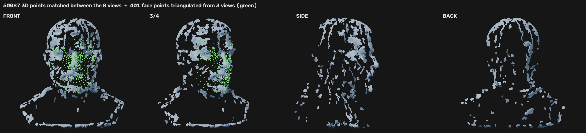
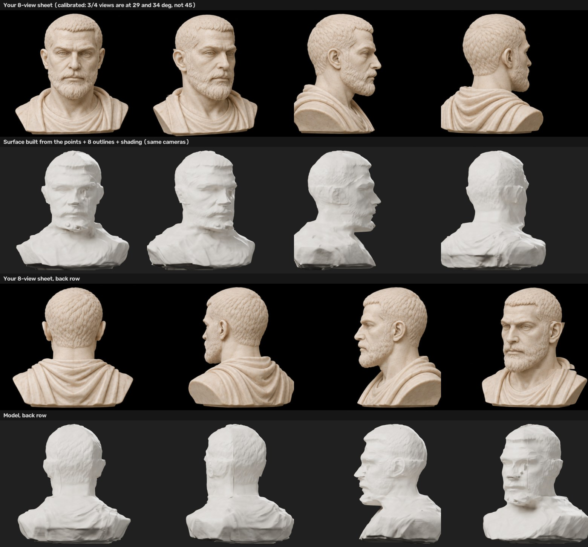

# 8-view sheet → points → surface (experiment, not in Mode 4)

This rebuilds the bust from an **8-view sheet** (4×2 grid: front, front-right 3/4, right, back-right 3/4, back, back-left 3/4, left, front-left 3/4). It uses measured 3D points instead of guessed depth.

| Step | Script | Does |
|---|---|---|
| 0 | `v0_split.py` | Split the sheet at the background gaps, cut out each bust |
| 1 | `v1_landmarks.py` | MediaPipe face points on every view. Faces are found in front, both 3/4 and the right profile. |
| 2 | `v2_triangulate.py 0`, `v2b_fill.py` | Triangulate the same face point across 3 views. Camera angles are solved too: the 3/4 views are at **29° and −34°**, not 45°. 401 measured 3D face points. |
| 3 | `v3_calib.py` | Calibrate all 8 cameras: the face for the front views, mirror pairs for the back views (outline IoU 0.90–0.96). Resample into one frame. |
| 4 | `v4_hull.py` | 8-outline visual hull |
| 5 | `v5_stereo.py` → `v5b_points.py` → `v5c_cloud_render.py` | Stereo between neighbouring views. Rows are shared, so a pair is rectified by stretching around the bisector angle. 150k matches → **50,087 clean 3D points** all around. |
| 6 | `v6_base.py` | Surface from points: smooth hull + robust offset field from the points (median of 60 neighbours) + the triangulated face mesh (eyes and mouth capped, faded under the beard) |
| 7 | `v7_sfs.py` → `v8_fuse.py` | Shading detail on all 8 views, then TSDF fusion with consensus and hull carving |
| 8 | `v9_grid.py` → `../multiview/mv7b_clean.py` → `../multiview/mv8_mesh.py` | Same Rhino grid as Mode 4 |
| 9 | `v_render.py`, `v10_sheet.py` | Renders with the 8 calibrated cameras |

**Result:**
- The shape matches all 8 views, measured from every side.
- The surface is **rougher than the 4-view model**, so Mode 4 keeps the 4-view data. Three reasons:
  - **Small views:** about 440 px each; the face is about 190 px wide.
  - **Flat light:** the shading part is only about 0.15 of the ambient level, so shape-from-shading has little to read.
  - **AI views disagree:** the 3/4 views are at 29° and 34°, the face is 8% smaller in one view, and the drapery differs per view. More views means more disagreement to average away.

**To beat the 4-view model with this method:**
- Use a 4K sheet, or one 2048 px image per view.
- Keep one clear key light from the upper left in every view.
- Use exact 45° steps, with the camera at head height.
