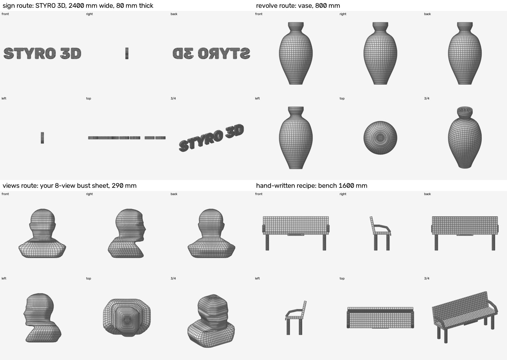

# qmesh: image → clean closed quad mesh (cloud + Rhino)

This turns photos, views sheets or a photo with real dimensions into **closed meshes with clean topology**: even quads, edge loops that follow the form, watertight, in real millimetres.

The same pure-Python kernel (`s3d_qmesh.py`) runs in a cloud chat and inside Rhino 7 / 8. A recipe therefore builds the identical mesh in both places. In Rhino, one switch also gives you a **SubD** and a **NURBS polysurface**.

## Pick the route by the shape

| Object | Route | Command |
|---|---|---|
| Letters, logo, sign, relief, cut-out | `sign`: outline → extrude | `python qmesh_image.py sign logo.png --width-mm 2400 --thickness-mm 80 --build` |
| Vase, column, baluster, bottle, lamp | `revolve`: front silhouette → revolve | `python qmesh_image.py revolve vase.png --height-mm 800 --build` |
| Bust, figure, animal, product (2 / 4 / 8 views) | `views`: visual hull → ring sections → quad lofts | `python qmesh_image.py views sheet.png --views 8 --height-mm 1800 --build` |
| Furniture, machines, props | Hand-written recipe (Claude writes it from the photo + dimensions) | `python qmesh_build.py examples/bench.json` |

Each route writes `<name>_recipe.json`, an editable file in mm, and then builds:

| File | What it is |
|---|---|
| `<name>.obj` | All parts, **quads kept**, one object per part |
| `<name>_mm.stl` | Triangulated copy for CNC and slicers |
| `<name>_report.json` | Per part: closed, manifold, oriented, shells, genus, quads %, edge evenness, size, volume |
| `<name>_views.png` | 6 views with edges drawn, so you can see the topology |

**In Rhino:** `_RunPythonScript` → `s3d_qmesh_rhino.py` → pick the recipe or the OBJ. Then choose the output:
- `mesh`
- `subd`
- `nurbs`: mesh + SubD + polysurface, with an `IsSolid` check.

Keep `s3d_qmesh.py` in the same folder as the script.

**Needs (cloud):** `pip install numpy scipy opencv-python-headless scikit-image`. The kernel and the Rhino script need nothing extra.

## What "clean" means here (checked on every part)

- **Closed and consistent:** closed, manifold, consistently oriented, one shell per part, volume > 0.
- **Structured:** rings × segments, Coons quad caps, and a quad sphere with **no poles**.
- **Even spacing:** profiles and paths are resampled to the target edge length, keeping corners. Loft rings are spaced by distance along the surface, so near-flat areas like shoulders get enough rings.
- **No mesh booleans:** touching parts stay separate closed shells. Join them in Rhino on the SubD / NURBS versions if you need one solid.

## Tests (`../tests/test_qmesh.py`, all pass)

| Test | Result |
|---|---|
| Kernel builders | All closed, manifold and oriented, with the right genus (torus = 1). Box and extrude volumes exact. Sphere within 2 %. |
| Sign "STYRO 3D", 2400 mm | 7 closed letters; the holes in R, O and D are kept (genus 1). Front outline match **97.1 %**. |
| Vase, 800 mm | 100 % quads. Front outline match **99.5 %**. |
| Snowman with a nose, 900 mm, from a 4-view sheet | 100 % quads, closed. Mean distance to the true shape **15–17 mm** (1.7–1.9 %). |
| Your 8-view bust sheet, 290 mm | 2880 quads, closed, 7.1 L (Mode 4: 6.8 L) |
| Rhino script | Python 2.7 grammar and ASCII OK. Every RhinoCommon call exists in 7 and 8. The OBJ round trip matches the cloud build. |

## Limits

- **Hidden hollows.** The views route cannot see concave parts that no outline shows: eye sockets, the inside of a cup. They come out filled, as extra material.
- **4 views give a rough form.** Features that only the side view shows become bands. Use 8 views when you can.
- **Extruded caps are quad-dominant, not all-quad.** There is a grid inside and a thin triangle band at the outline, which is widest in thin strokes. Use a smaller `--edge-mm` for thin lettering.
- **Untested in Rhino.** The Rhino script has not been run inside Rhino yet. If it errors, paste the command-line text.

Recipe format and every op: [RECIPE.md](RECIPE.md). The Claude skill that drives all of this in a cloud chat: `/.claude/skills/image-to-qmesh/SKILL.md`.
